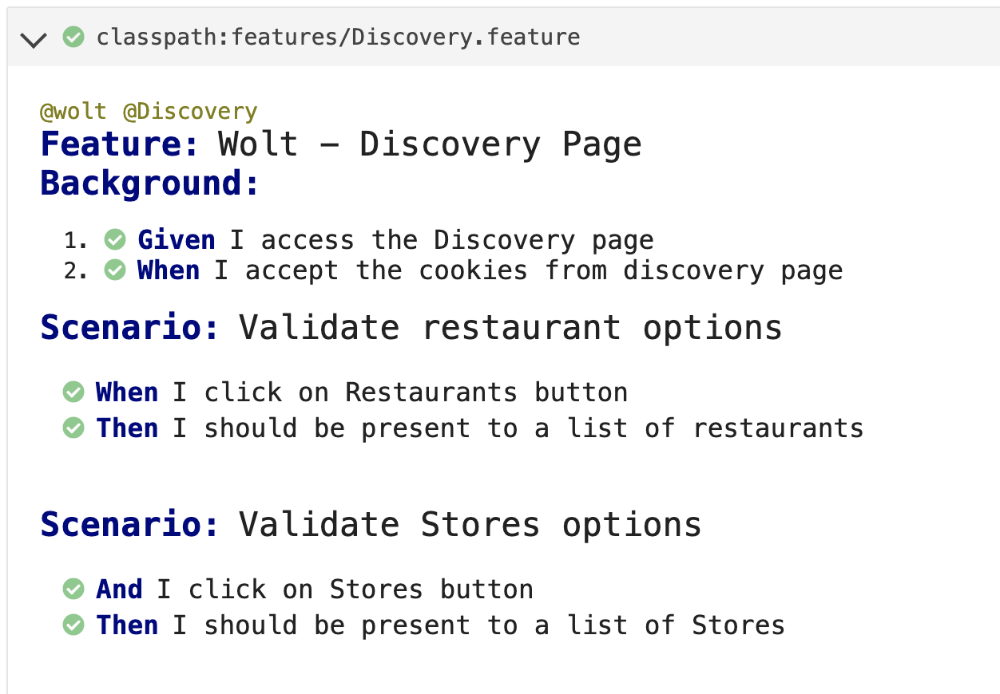
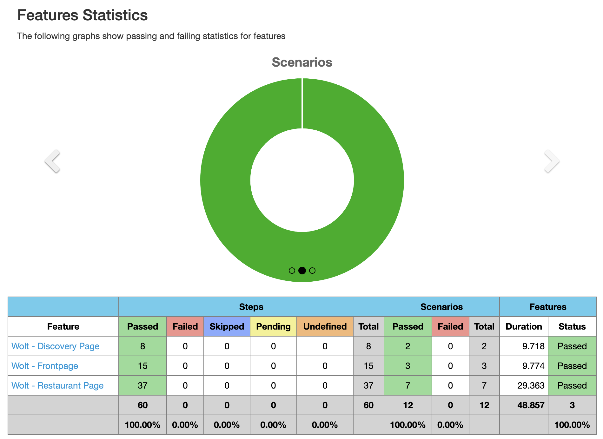

# wolt-selenium

## Description
A project to practice and showcase how to write automated tests in Java using Selenium Webdriver and cucumber combined.

This project contains many test scenarios for the https://wolt.com/ website.

## Usage

Requirements:
* Java (version 16 or newer)
* Maven (version 3.3 or newer)

Clone the repository and navigate to the created folder

```
git clone https://github.com/anacrm/wolt-selenium.git
cd wolt-selenium
```
Run the tests
```
mvn test
```
## Test Report
After running the tests the reports will be available in both HTML and JSON formats. And the reports files can be found in the `target` folder:

* cucumber.html
* cucumber.json

The html report can be opened on the browser and here is an example of how it looks:



## CI/CD integrations

It is also easy to integrate your own CI/CD tools with this project. I used Jenkins and here how it looks:



## Contact

You can contact me here on GitHub, via [LinkedIn](https://www.linkedin.com/in/ana-reis-qa/) or email at reismedeiros.ana@gmail.com